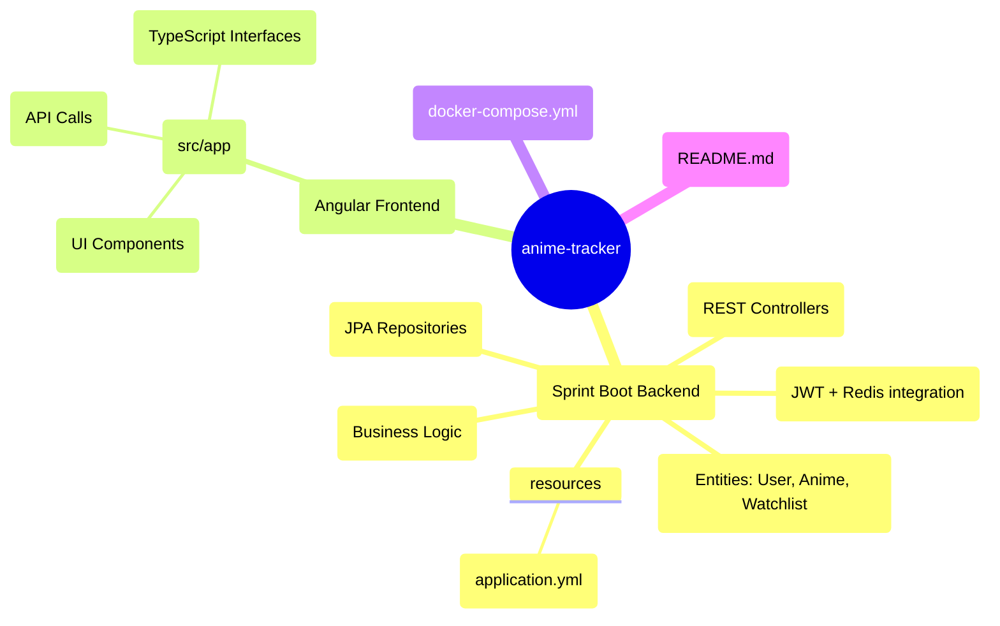

# 🎥 Anime Tracker

Anime Tracker is a **Spring Boot + Angular** application that helps users track their anime watchlist and discover upcoming anime episodes.  
It integrates with the **[Jikan API](https://docs.api.jikan.moe/)** (unofficial MyAnimeList API) to fetch anime data.

---

## 🚀 Features
- 🔐 **User Authentication** with JWT + Redis session caching  
- 📺 **Upcoming Anime Episodes** fetched from Jikan API  
- 📂 **User Watchlists** – mark anime as *Watching*, *Completed*, *On-Hold*, etc.  
- 🗄 **PostgreSQL Persistence** for users and watchlists  
- 🎨 **Angular Frontend** to provide a clean UI  
- 🐳 **Dockerized** for easy deployment  

---

## 🏗 Architecture (High-Level Design)

                   ┌─────────────────────────┐
                   │        Angular UI       │
                   │ (Anime Tracker Frontend)│
                   └─────────────┬───────────┘
                                 │  (REST API calls)
                                 ▼
                    ┌───────────────────────────┐
                    │     Spring Boot Backend   │
                    │ ────────────────────────  │
                    │  • Controllers            │
                    │  • Services               │
                    │  • Security (JWT + Redis) │
                    │  • Repositories (JPA)     │
                    └───────┬─────────┬───── ───┘
                            │         │
                            │         │
           ┌────────────────┘         └───────────────┐
           ▼                                          ▼
flowchart LR
    subgraph DB[PostgreSQL Database]
        U[Users]
        L[UserAnimeList]
    end

    subgraph API[Jikan API (v4)]
        A[Anime info source]
        E[Upcoming episodes]
    end

    subgraph Cache[Redis (Session Cache)]
        T[JWT tokens storage]
    end

    Backend[Spring Boot Backend] --> DB
    Backend --> API
    Backend --> Cache

    Frontend[Angular Frontend] --> Backend


## ⚙️ Tech Stack
- **Backend:** Spring Boot (latest), Spring Security, JPA (Hibernate)  
- **Database:** PostgreSQL (latest)  
- **Cache:** Redis (latest)  
- **Frontend:** Angular (latest)  
- **External API:** Jikan API (v4)  
- **Containerization:** Docker + Docker Compose  

---

### **2. Project Structure Tree**




---

## 📌 Why This Architecture?

This project uses a **monolithic, layered architecture** with clear separation of concerns:
- **Frontend (Angular)** → Handles UI, routes, and calls backend APIs.  
- **Backend (Spring Boot)** → Provides REST APIs, business logic, and integrates with external services (Jikan API).  
- **Database (PostgreSQL)** → Stores users and watchlists.  
- **Cache (Redis)** → Stores active JWT sessions for quick validation.  

✅ **Justification**:  
- A **monolith** is simpler to develop, test, and deploy for a small-to-medium app like this.  
- Spring Boot handles API orchestration, security, and data access efficiently.  
- Redis ensures performance in session handling.  
- Angular keeps the frontend modular and interactive.  
- Docker guarantees consistent environments for dev and deployment.  

---

## 🏗 What Other Architectures Could Be Used?

1. **Microservices Architecture**  
   - Each module (Auth, User, Anime Fetcher, Watchlist) could be its own service.  
   - Pros: Scalability, independent deployment.  
   - Cons: Overkill for a small project, adds DevOps complexity (service discovery, API Gateway, monitoring).  

2. **Serverless Architecture (FaaS, e.g., AWS Lambda)**  
   - Each backend function (auth, fetch anime, update watchlist) could be a Lambda.  
   - Pros: No server management, auto-scaling.  
   - Cons: Harder to manage state (sessions, DB connections), vendor lock-in.  

3. **Clean/Hexagonal Architecture**  
   - More strict separation between core business logic and external services.  
   - Pros: Very testable, highly maintainable.  
   - Cons: Adds extra abstraction layers that may not be necessary for MVP.  

---

## ▶️ Running Locally

### Prerequisites
- Docker & Docker Compose installed  
- Java 17+  
- Node.js + Angular CLI  

### Steps
```bash
# 1. Clone repository
git clone https://github.com/your-username/anime-tracker.git
cd anime-tracker

# 2. Start backend + db + redis
docker-compose up --build

# 3. Run frontend
cd frontend
npm install
ng serve


